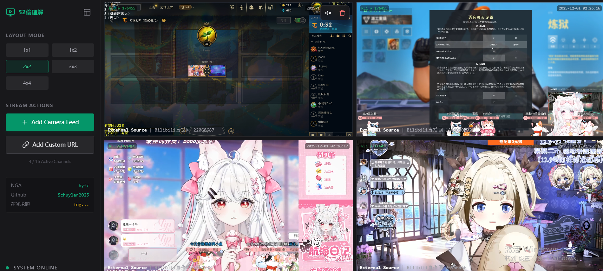

<!--
 * @Author: Schuyler schuylerhu@gmail.com
 * @Date: 2025-11-23 16:27:00
 * @LastEditors: Schuyler schuylerhu@gmail.com
 * @LastEditTime: 2025-12-01 10:36:13
 * @FilePath: \ominiview-monitor\README.md
 * @Description:
 *
 * Copyright (c) 2025 by Schuyler, All Rights Reserved.
-->


<div align="center">

</div>
# Ominiview Monitor

一个现代化的多流监控应用，支持虎牙和斗鱼直播平台的实时流媒体播放


## ✨ 特性

- 🎥 **多流监控** - 同时监控多个直播流，支持灵活的网格布局
- 🎮 **平台支持** - 原生支持虎牙(HuYa)、B站(Bilibili)和斗鱼(DouYu)直播平台
- 📱 **响应式设计** - 自适应不同屏幕尺寸和布局模式
- 🔄 **智能解析** - 自动解析直播链接，支持FLV和HLS格式
- 🎛️ **交互控制** - 支持静音、刷新、移除等操作
- 🎨 **现代化UI** - 基于Tailwind CSS的暗色主题界面

## 🚀 快速开始

### 环境要求

- Node.js 18+
- npm

### 安装依赖

```bash
npm install
```

### 快速上手

### 快速上手：3步本地部署（新手友好）
#### 1. 克隆源码
```bash
git clone https://github.com/Schuyler2025/ominiview-monitor.git
cd ominiview-monitor
```
#### 2. 启动前端（React）
```bash
npm install  # 安装依赖
npm run build
npm run preview
```

#### 3. 启动后端（Node.js）
```bash
cd server
npm install
npm start  # 启动服务

```

#### 使用方法：
1. 打开http://localhost:4173；
2. 复制虎牙/斗鱼主播直播间链接（比如https://www.huya.com/xxx）；
3. 粘贴到输入框，点击“添加直播”；
4. 右上角切换布局，点击直播卡片的🔇/❌控制静音/关闭。


<div align="center">

</div>


## 🤝 贡献

欢迎提交Issue和Pull Request来改进这个项目！

## 📄 许可证

MIT License

---

**注意**: 本项目仅供学习和开发使用，请遵守相关平台的使用条款